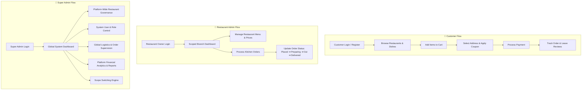

# 🍕 Tap Foods - Enterprise Multi-Vendor Food Delivery & Restaurant Management System

---

## 📌 Executive Overview

**Tap Foods** is a high-performance, enterprise-grade, multi-vendor online food ordering and restaurant management platform (similar to Swiggy / Zomato). Built using **Java EE (Jakarta Servlets & JSP)**, **MySQL**, and modern **Glassmorphism Web Interfaces**, the system seamlessly orchestrates interactions across three distinct user roles:

1. **Customers**: Browse restaurants, search dish menus, manage shopping carts, apply discount coupons, select delivery addresses, pay via multiple gateways, and track real-time order delivery status.
2. **Restaurant Admins (Owners / Branch Managers)**: Manage branch profiles, control dish availability and pricing in real-time, process incoming kitchen orders, and track branch-specific sales revenue.
3. **Super Admins (Platform Administrators)**: Oversee global platform logistics, onboard and regulate all restaurants, manage customer accounts, inspect system audit logs, analyze financial reports, and dynamically switch administrative execution scopes.

---

## 🛠️ Key Skills & Technologies Applied

### 1. **Backend & Architecture**
- **Java 17 & Jakarta EE**: Standardized servlet containers using `jakarta.servlet.*` annotations (`@WebServlet`).
- **MVC (Model-View-Controller)**: Strict separation of presentation (`.jsp`), request processing (`Servlets`), business logic, and persistence layers.
- **DAO (Data Access Object) Pattern**: Decoupled interface definitions (`UserDAO`, `RestaurantDAO`, `MenuDAO`, `OrderDAO`, `AdminDAO`) and concrete implementations (`UserDAOImpl`, etc.).
- **JDBC & Connection Resilience**: Custom `DBConnection` utility featuring multi-password fallback connection discovery and automatic dynamic schema migration (`ensureSchema`).

### 2. **Security & Authentication**
- **BCrypt Hashing**: Password hashing and salt verification (`org.mindrot.jbcrypt.BCrypt`).
- **Role-Based Access Control (RBAC)**: Fine-grained multi-tier authorization (`CUSTOMER`, `RESTAURANT_ADMIN`, `SUPER_ADMIN`, `DELIVERY`).
- **Audit & Security Logging**: Security logging (`AdminLog`) and session history tracking (`login_history`) recording IP addresses and browser signatures.
- **Session Scoping & Scope Switching**: Dynamic administrative scope switching via `AdminScopeServlet`.

### 3. **Frontend & UX Design**
- **Glassmorphism CSS Design System**: Dark-themed UI with frosted glass backdrops (`backdrop-filter`), vibrant CSS gradients, modern Google Fonts, dynamic layout grids, and interactive state micro-animations.
- **Dynamic JavaScript & AJAX**: Client-side form validation, modal dialogs, search/filter controls, and async state polling.

### 4. **Database & Data Management**
- **MySQL 8.0 Relational Model**: 15+ normalized relational tables with foreign key cascades, timestamping, auto-incrementing primary keys, and dynamic schema evolution.

---

## 🔄 End-to-End System Workflow At a Glance

---

## 👑 Super Admin vs. 🏢 Restaurant Admin Roles Overview

| Feature / Dimension | 👑 Super Admin (Platform Admin) | 🏢 Restaurant Admin (Owner) |
| :--- | :--- | :--- |
| **Access Scope** | Global System Scope (`isSuperAdmin = true`, `assignedRestaurantId = 0`) | Scoped Multi-Tenant (`isSuperAdmin = false`, `assignedRestaurantId = X`) |
| **Restaurant Governance** | Onboard, edit, activate/deactivate, or delete any restaurant on the platform | Edit profile & settings of assigned restaurant branch only |
| **Menu Control** | Add, modify, or remove food items for any restaurant | Manage prices, images, and availability of own menu dishes |
| **Order Supervision** | View & manage logistics for all platform orders across all restaurants | Manage kitchen order fulfillment queue for own branch only |
| **User Governance** | Manage all customer accounts, change roles, activate/block users | View customer detail associated with active orders |
| **Financial Analytics** | Platform gross revenue, commission breakdown, multi-restaurant profit comparison | Branch-specific net revenue, daily sales summary, top-selling dishes |
| **Scope Switching** | Can emulate any Restaurant Admin scope dynamically via `AdminScopeServlet` | Restricted strictly to assigned restaurant scope |

---

## 📁 Detailed Documentation File

For the full, exhaustive technical specification, database schema breakdown, deep-dive role matrix, and servlet execution flow, view the dedicated companion guide:

👉 **[SYSTEM_ARCHITECTURE_AND_ADMIN_GUIDE.md](file:///d:/AntiGravity/Food%202/SYSTEM_ARCHITECTURE_AND_ADMIN_GUIDE.md)**

---

## 💻 How to Run Locally

1. **Database Setup**:
   - Ensure MySQL Server is running on port `3306`.
   - Create database: `CREATE DATABASE tap_foods;`
   - Update credentials in `DBConnection.java` if needed.
2. **Deploy to Servlet Container**:
   - Build project using Apache Maven or Eclipse Web Tools.
   - Deploy generated WAR or explode application onto Apache Tomcat 10+ (Jakarta EE compliant).
3. **Access Application**:
   - App Root: `http://localhost:8080/Food_2/`
   - Admin Login: `http://localhost:8080/Food_2/login.jsp`
