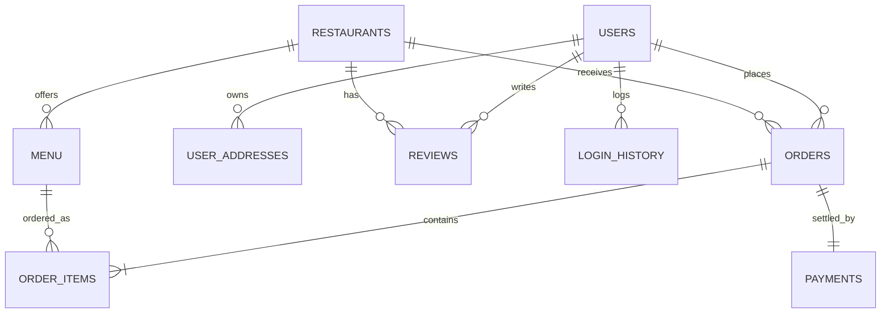

# 📚 Tap Foods: Complete End-to-End System Architecture, Administration & Technical Specification Manual

## 📋 Table of Contents
1. [Executive Summary & System Purpose](#1-executive-summary--system-purpose)
2. [Technical Stack & Core Skills Mastered](#2-technical-stack--core-skills-mastered)
3. [Architectural Design Patterns](#3-architectural-design-patterns)
4. [End-to-End System Workflow (Customer Journey)](#4-end-to-end-system-workflow-customer-journey)
5. [In-Depth Administration Architecture](#5-in-depth-administration-architecture)
   - [5.1 Super Admin (Platform Super Administrator)](#51-super-admin-platform-super-administrator)
   - [5.2 Restaurant Admin (Restaurant Owner / Branch Manager)](#52-restaurant-admin-restaurant-owner--branch-manager)
   - [5.3 Administrative Scope Switching Mechanics](#53-administrative-scope-switching-mechanics)
   - [5.4 Granular Permission & Feature Comparison Matrix](#54-granular-permission--feature-comparison-matrix)
6. [Database Schema & Data Access Layer](#6-database-schema--data-access-layer)
7. [Servlet & View Mapping Reference](#7-servlet--view-mapping-reference)
8. [Security & Audit Engineering](#8-security--audit-engineering)
9. [Deployment & Environmental Configuration](#9-deployment--environmental-configuration)

---

## 1. Executive Summary & System Purpose

**Tap Foods** is an enterprise-class, multi-vendor online food ordering and food logistics platform. Designed to mirror the robust functionality of modern hyper-local delivery giants (such as Swiggy, Zomato, and Uber Eats), Tap Foods provides a multi-tenant platform connecting three critical stakeholders:

1. **End Customers**: Users seeking food discovery, real-time menu customization, shopping cart persistence, multi-mode secure payments, and order tracking.
2. **Restaurant Owners / Branch Admins**: Independent merchants who manage their specific restaurant profiles, adjust real-time dish availability, set pricing, and process kitchen orders.
3. **Platform Super Administrators**: Central platform managers who govern restaurant onboarding, oversee cross-restaurant logistics, manage user security, review overall financial health, and access platform-wide analytics.

---

## 2. Technical Stack & Core Skills Mastered

The development of Tap Foods encompasses a broad spectrum of modern web software engineering disciplines:

### 🛠️ Backend Core & Java Enterprise Technology
- **Java 17 (LTS)**: Core application logic using modern Java syntax, OOP design, Collections framework, and Stream processing.
- **Jakarta EE 10 (Servlets 6.0 & JSP 3.1)**: HTTP request handling via annotation-driven Servlets (`@WebServlet`), request forwarding, redirects, session lifecycle management, and dynamic JSP rendering.
- **JDBC (Java Database Connectivity)**: Direct DB access using `DriverManager`, parameterized `PreparedStatement` to eliminate SQL injection risks, `ResultSet` mapping, and manual connection lifecycle management.
- **BCrypt Cryptographic Hashing**: Secure password hashing utilizing `org.mindrot.jbcrypt.BCrypt` with salted hash verification.

### 🎨 Frontend & Design System
- **HTML5 & Semantic Markup**: Accessible web structuring using native HTML5 tags, form controls, and validation attributes.
- **Modern Glassmorphism CSS3**: Dark mode UI featuring `backdrop-filter: blur()`, custom CSS root variables, dynamic grid layouts (`display: grid`), flexible boxes (`flexbox`), responsive media queries, and micro-animations.
- **Vanilla JavaScript & Asynchronous AJAX**: Async `fetch` requests, client-side dynamic DOM updates, real-time search/filtering without page reloads, interactive modal dialogs, and instant cart calculation.

### 💾 Persistence & Relational Database Engineering
- **MySQL 8.0 Relational Database**: Multi-table schema architecture with foreign key relationships (`FOREIGN KEY ... REFERENCES`), indices, cascade options, auto-increment keys, and Timestamp fields.
- **Dynamic Schema Migration**: Resilient bootstrap schema adjustments (`DBConnection.ensureSchema`) executed automatically during DB initialization.

---

## 3. Architectural Design Patterns

Tap Foods follows enterprise software architecture patterns to guarantee scalability, clean code separation, and maintainability.

```
       +-------------------------------------------------------+
       |                     WEB BROWSER                       |
       +-------------------------------------------------------+
                                  |
                        HTTP Requests / Responses
                                  |
                                  v
+---------------------------------------------------------------------+
|                      CONTROLLER LAYER (Servlets)                    |
|  [LoginServlet]  [CartServlet]  [CheckoutServlet] [AdminScopeServlet]|
+---------------------------------------------------------------------+
        |                                             |
  Reads / Updates Session                       Invokes Business Logic
        |                                             |
        v                                             v
+-----------------------+              +------------------------------+
|    VIEW LAYER (JSP)   |              |  MODEL & DAO LAYER (Java)    |
| [index.jsp] [cart.jsp]| <----------- | [User] [Restaurant] [Menu]   |
|[dashboard.jsp][etc.]  |              | [UserDAOImpl] [MenuDAOImpl]  |
+-----------------------+              +------------------------------+
                                                      |
                                           Executes Prepared SQL
                                                      |
                                                      v
                                       +------------------------------+
                                       |      MYSQL DATABASE          |
                                       |         (tap_foods)          |
                                       +------------------------------+
```

### 1. Model-View-Controller (MVC) Architectural Pattern
- **Model**: Java POJO classes (`User`, `Restaurant`, `Menu`, `Order`, `Cart`, `Admin`, `Payment`) representing database domain entities and state container.
- **View**: JavaServer Pages (JSPs) located in `src/main/webapp/` and `src/main/webapp/admin/` responsible strictly for presenting markup and rendering dynamic attributes.
- **Controller**: Java Servlets located in `com.tap.servlet.*` acting as request routers, authenticators, parameter validators, and orchestrators between the DAO layer and JSP views.

### 2. Data Access Object (DAO) Pattern
- Clear interface contracts (`UserDAO`, `RestaurantDAO`, `MenuDAO`, `OrderDAO`, `AdminDAO`, `CartDAO`) defining required persistence operations (`add`, `getById`, `update`, `delete`, `getAll`).
- Concrete implementations (`UserDAOImpl`, `RestaurantDAOImpl`, etc.) encapsulating raw JDBC queries, connection management, and SQL error handling.

### 3. Failover Connection Strategy Pattern
- The `DBConnection` class implements a dynamic password-cycling failover mechanism to attempt connecting across common MySQL password profiles (`Black@hider3306`, `root`, `root123`, `123456`, `admin`, etc.) to guarantee seamless operation across local and production developer environments.

---

## 4. End-to-End System Workflow (Customer Journey)

```
[ User Registration ] ➔ [ User Login ] ➔ [ Browse Restaurants ] ➔ [ Select Dish Menu ]
                                                                             │
[ Order History & Review ] ◄── [ Live Tracking ] ◄── [ Payment ] ◄── [ Cart & Checkout ]
```

### Step 1: Account Creation & Authentication
- **Registration (`RegisterServlet.java` & `register.jsp`)**: User submits name, email, phone number, password, gender, and date of birth. Password is BCrypt salted/hashed before storage in the `users` table. Optional Email OTP verification (`EmailOTP.java`, `EmailUtility.java`) verifies email authenticity.
- **Login (`LoginServlet.java` & `login.jsp`)**: Supports both standard email/password authentication and Google OAuth mock authentication (`googleEmail`). Upon success, records IP address and User-Agent in `login_history`, creates an active `HttpSession` (30-minute default timeout), and loads existing cart items.

### Step 2: Restaurant & Menu Discovery
- **Restaurant Index (`index.jsp` & `restaurants.jsp`)**: Customers view active restaurants, complete with cuisine types, delivery times, customer rating stars, addresses, and banner images.
- **Menu Browsing (`menu.jsp` & `MenuServlet.java`)**: Customers view categorized menus for a selected restaurant. Items display pricing, descriptions, vegetarian/non-vegetarian tags, availability status (`isAvailable`), and ratings.

### Step 3: Shopping Cart Operations (`CartServlet.java` & `cart.jsp`)
- Cart state is maintained in `HttpSession` as a `Map<Integer, CartItem>`.
- Actions supported: `ADD`, `UPDATE` (quantity adjustments), `DELETE` (single item removal), `CLEAR`.
- Pre-login cart state is preserved when a user logs in mid-session.

### Step 4: Checkout & Address Selection (`CheckoutServlet.java` & `checkout.jsp`)
- Customer selects a pre-saved address (`user_addresses` table) or enters a new delivery address (`addAddress.jsp`).
- Customer applies valid promotional coupons (`coupons.jsp`, `user_coupons`), dynamically recalculating the subtotal, taxes, delivery fees, and net discount amount.

### Step 5: Multi-Channel Payment Processing (`PaymentServlet.java` & `payment.jsp`)
- Customer selects payment method: **UPI**, **Credit/Debit Card**, **Net Banking**, or **Cash on Delivery (COD)**.
- Orders are atomically created across `orders` and `order_items` tables via JDBC transactions. Payment record is written to `payments` with status `COMPLETED` or `PENDING`.

### Step 6: Live Order Tracking & Reviews (`orders.jsp`, `orderDetails.jsp`, `reviews.jsp`)
- Customer tracks live status (`PLACED` ➔ `PREPARING` ➔ `OUT_FOR_DELIVERY` ➔ `DELIVERED`).
- Upon completion, customers can post ratings and text reviews for both the restaurant and individual dishes.

---

## 5. In-Depth Administration Architecture

The administration subsystem is engineered with a **Multi-Tenant Scoped Architecture** supporting dual administrative roles: **Platform Super Admin** and **Restaurant Admin**.

---

### 5.1 Super Admin (Platform Super Administrator)

#### Identity & Scope Definition
- **Attribute Criteria**: `role = "SUPER_ADMIN"` or `role = "ADMIN"`, and `assignedRestaurantId = 0` (or `null`).
- **Access Boundary**: Global / Platform-wide unrestricted scope.

#### Core Capabilities & Operations
1. **Global Restaurant Management (`admin/restaurants.jsp`, `addRestaurant.jsp`, `editRestaurant.jsp`)**:
   - Onboard new restaurant partners into the system.
   - Edit profile info, change cuisine categories, update owner user IDs, modify operating hours, update addresses, and activate or deactivate restaurant branches.
   - Delete non-operational restaurants.

2. **Global Menu Supervision (`admin/menus.jsp`, `addMenu.jsp`, `editMenu.jsp`)**:
   - Access and edit dish menus across **all** registered restaurants.
   - Add new dishes, adjust prices, edit food descriptions, toggle dish availability, and update dish image URLs.

3. **Global Logistics & Order Monitoring (`admin/orders.jsp`)**:
   - View every order placed across the entire platform in real time.
   - Filter orders by restaurant ID, status, or date range.
   - Override order statuses (e.g., mark as `CANCELLED`, `PREPARING`, `DELIVERED`).
   - Assign or reassign delivery agents (`DeliveryAgentDAO`).

4. **User & Account Governance (`admin/users.jsp`, `addUser.jsp`, `editUser.jsp`)**:
   - View all registered users (Customers, Restaurant Owners, Delivery Agents, Admins).
   - Edit user profile details, elevate user roles (`CUSTOMER` ➔ `ADMIN` / `RESTAURANT_ADMIN`), and suspend or reactivate accounts (`ACTIVE` / `INACTIVE`).

5. **Platform Analytics & Financial Reports (`admin/reports.jsp`)**:
   - Executive dashboard displaying global platform KPIs: Total Sales Revenue, Total Orders Processed, Active Restaurants, Total Registered Users, Average Order Value.
   - Visual financial breakdowns: Daily Revenue trends, Payment Method distribution (UPI vs Card vs COD), Restaurant Profit Margins, and Platform Commission collections.
   - Export financial reports (simulated PDF/Excel/CSV export).

6. **System Security Audit & Login Logs (`admin/loginHistory.jsp`)**:
   - Inspect full system login logs: User ID, Login Timestamp, IP Address, Device / Browser User-Agent string, and Authentication Status (`SUCCESS` / `FAILED`).

---

### 5.2 Restaurant Admin (Restaurant Owner / Branch Manager)

#### Identity & Scope Definition
- **Attribute Criteria**: `role = "RESTAURANT_ADMIN"` or `OWNER` / `VENDOR`, and `assignedRestaurantId = <Specific Restaurant ID > 0>`.
- **Access Boundary**: Strictly isolated multi-tenant boundary bounded by `assignedRestaurantId`.

#### Core Capabilities & Operations
1. **Scoped Restaurant Profile Control (`admin/editRestaurant.jsp`)**:
   - View and update details **only** for their assigned restaurant branch.
   - Modify contact phone numbers, operating hours, delivery fee structures, and promotional banners.
   - Blocked by server-side verification from editing or viewing other restaurants (`if (assignedRestaurantId != restaurantId) { redirect / error; }`).

2. **Kitchen Menu & Pricing Management (`admin/menus.jsp`, `addMenu.jsp`, `editMenu.jsp`)**:
   - Full CRUD control restricted to dishes linked to `assignedRestaurantId`.
   - Toggle dish availability in real time (e.g., mark items "Out of Stock" during peak kitchen hours).
   - Update prices, dish names, categories, and image links.

3. **Kitchen Order Processing Queue (`admin/orders.jsp`)**:
   - Real-time kitchen display viewing orders placed specifically to their restaurant.
   - Progress order fulfillment stages:
     `PLACED` ➔ `PREPARING` (Kitchen accepted order) ➔ `OUT_FOR_DELIVERY` (Handed to courier) ➔ `DELIVERED`.
   - View order item breakdowns, special customer instructions, and delivery addresses.

4. **Branch Sales & Profit Analytics (`admin/reports.jsp`)**:
   - View financial performance reports filtered exclusively for their restaurant branch.
   - Track daily sales volume, average order values, top-selling menu items, and net revenue payouts.

---

### 5.3 Administrative Scope Switching Mechanics

The platform includes an **Admin Scope Switching Engine** controlled by `AdminScopeServlet.java` (`/admin/switchScope`). This feature allows platform Super Admins to dynamically switch administrative execution contexts during runtime for debugging, auditing, or branch operational support.

```
                  +-----------------------------------+
                  |      SUPER ADMIN DASHBOARD        |
                  +-----------------------------------+
                                    |
                    Select Scope Switch Action in Header
                                    |
                                    v
                  +-----------------------------------+
                  |     AdminScopeServlet.java        |
                  +-----------------------------------+
                         /                     \
                        /                       \
        Target: SUPER_ADMIN            Target: RESTAURANT_OWNER
                       /                         \
                      v                           v
     Set assignedRestaurantId = 0   Set assignedRestaurantId = RestID
     Set adminRole = "SUPER_ADMIN"  Set adminRole = "RESTAURANT_ADMIN"
                      \                           /
                       \                         /
                        v                       v
                  +-----------------------------------+
                  |      Redirect to Dashboard        |
                  |     (With Updated Permissions)    |
                  +-----------------------------------+
```

#### How Scope Switching Works Code-Level (`AdminScopeServlet.java`):
1. **Switching to Super Admin Scope**:
   - Request parameter: `authType = "ADMIN"`, with admin identifier & password validation (via BCrypt or master fallback).
   - Session mutations:
     ```java
     session.setAttribute("adminRole", "SUPER_ADMIN");
     session.setAttribute("assignedRestaurantId", 0);
     session.setAttribute("adminAccount", admin);
     ```
   - Result: All administrative JSP pages render global platform data across all restaurants.

2. **Switching to Restaurant Owner Scope**:
   - Request parameter: `authType = "RESTAURANT_OWNER"`, with target `restaurantId`.
   - Servlet validates target restaurant existence via `RestaurantDAO.getRestaurant(restId)`.
   - Session mutations:
     ```java
     session.setAttribute("adminRole", "RESTAURANT_ADMIN");
     session.setAttribute("assignedRestaurantId", restId);
     session.setAttribute("assignedRestaurant", rest);
     ```
   - Result: All administrative JSP pages automatically scope SQL queries to `assignedRestaurantId`, insulating data to that specific branch.

---

### 5.4 Granular Permission & Feature Comparison Matrix

| Action / Module | 👑 Super Admin Mode | 🏢 Restaurant Admin Mode | Customer |
| :--- | :---: | :---: | :---: |
| **Browse Public Restaurants & Menus** | ✅ | ✅ | ✅ |
| **Place Food Orders & Pay** | ✅ | ✅ | ✅ |
| **View All Platform Restaurants** | ✅ | ❌ (Own Resto Only) | ❌ |
| **Add / Create New Restaurant** | ✅ | ❌ | ❌ |
| **Edit Any Restaurant Profile** | ✅ | ❌ (Own Resto Only) | ❌ |
| **Delete Restaurant Branch** | ✅ | ❌ | ❌ |
| **View All Platform Menus** | ✅ | ❌ (Own Menu Only) | ❌ |
| **Add / Edit Menu Items** | ✅ (Any Resto) | ✅ (Own Resto Only) | ❌ |
| **Delete Menu Items** | ✅ (Any Resto) | ✅ (Own Resto Only) | ❌ |
| **View All Platform Orders** | ✅ | ❌ (Own Orders Only)| ❌ |
| **Update Kitchen Order Status** | ✅ | ✅ (Own Orders Only)| ❌ |
| **Re-assign Delivery Agents** | ✅ | ❌ | ❌ |
| **View All Registered Platform Users** | ✅ | ❌ | ❌ |
| **Elevate User Roles / Suspend Accounts**| ✅ | ❌ | ❌ |
| **View Platform Financial Analytics** | ✅ (Global KPIs) | ❌ (Branch KPIs Only)| ❌ |
| **View System Audit & Login History** | ✅ | ❌ | ❌ |
| **Dynamic Scope Switching** | ✅ | ❌ | ❌ |

---

## 6. Database Schema & Data Access Layer

The underlying database `tap_foods` consists of normalized relational tables designed for multi-tenant food delivery operations.



### Table Specifications Summary

1. **`users`**:
   - `user_id` (PK, INT AUTO_INCREMENT), `full_name` (VARCHAR), `email` (VARCHAR UNIQUE), `phone` (VARCHAR), `password` (VARCHAR - BCrypt Hash), `gender` (VARCHAR), `dob` (DATE), `profile_image` (VARCHAR), `status` (VARCHAR - 'ACTIVE'/'INACTIVE'), `role` (VARCHAR - 'CUSTOMER'/'ADMIN'/'RESTAURANT_ADMIN'/'DELIVERY'), `created_at`, `updated_at`.

2. **`admins`**:
   - `admin_id` (PK, INT), `name`, `username`, `email`, `password`, `phone_number`, `role` ('SUPER_ADMIN'/'RESTAURANT_ADMIN'), `active` (BOOLEAN), timestamps.

3. **`restaurants`**:
   - `restaurant_id` (PK, INT AUTO_INCREMENT), `name`, `cuisine_type`, `delivery_time`, `address`, `admin_user_id` (FK to users/admins), `rating` (FLOAT), `is_active` (BOOLEAN), `image_path` (LONGTEXT).

4. **`menu` / `menu_items`**:
   - `menu_id` (PK, INT AUTO_INCREMENT), `restaurant_id` (FK to restaurants), `item_name`, `description`, `price` (DECIMAL), `rating` (FLOAT), `is_available` (BOOLEAN), `image_path` (LONGTEXT).

5. **`orders`**:
   - `order_id` (PK, INT AUTO_INCREMENT), `user_id` (FK to users), `restaurant_id` (FK to restaurants), `total_amount` (DECIMAL), `status` ('PLACED'/'PREPARING'/'OUT_FOR_DELIVERY'/'DELIVERED'/'CANCELLED'), `payment_mode`, `order_date` (TIMESTAMP).

6. **`order_items`**:
   - `order_item_id` (PK, INT AUTO_INCREMENT), `order_id` (FK to orders), `menu_id` (FK to menu), `quantity` (INT), `item_total` (DECIMAL).

7. **`payments`**:
   - `payment_id` (PK, INT AUTO_INCREMENT), `order_id` (FK to orders), `payment_method` ('UPI'/'CARD'/'NET_BANKING'/'COD'), `payment_status` ('PENDING'/'COMPLETED'/'FAILED'), `transaction_id`, `created_at`.

8. **`user_addresses`**:
   - `address_id` (PK, INT), `user_id` (FK), `street_address`, `city`, `state`, `postal_code`, `is_default` (BOOLEAN).

9. **`coupons` & `user_coupons`**:
   - `coupon_id`, `code`, `discount_percentage`, `max_discount`, `min_order_amount`, `expiry_date`, `is_active`.

10. **`login_history`**:
    - `history_id` (PK), `user_id`, `login_time`, `ip_address`, `device_info`, `login_status`.

11. **`admin_logs`**:
    - `log_id` (PK), `admin_id`, `action`, `details`, `timestamp`.

12. **`reviews`**:
    - `review_id` (PK), `user_id`, `restaurant_id`, `menu_id`, `rating`, `comment`, `created_at`.

---

## 7. Servlet & View Mapping Reference

| Request URL Endpoint | Associated Servlet Class | Associated JSP / View | Description / Purpose |
| :--- | :--- | :--- | :--- |
| `/login` | `LoginServlet.java` | `login.jsp` | Processes customer and admin logins, handles Google mock auth, initializes session & role state. |
| `/register` | `RegisterServlet.java` | `register.jsp` | Creates new customer account with BCrypt password hashing. |
| `/logout` | `LogoutServlet.java` | N/A (Redirect) | Invalidates HTTP session and clears security context. |
| `/cart` | `CartServlet.java` | `cart.jsp` | Handles cart operations (`ADD`, `UPDATE`, `DELETE`, `CLEAR`). |
| `/checkout` | `CheckoutServlet.java` | `checkout.jsp` | Manages checkout state, address selection, and coupon application. |
| `/payment` | `PaymentServlet.java` | `payment.jsp`, `orderSuccess.jsp` | Executes payment processing and writes database order records. |
| `/menu` | `MenuServlet.java` | `menu.jsp` | Fetches and renders categorized menu items for a selected restaurant. |
| `/restaurant` | `RestaurantServlet.java` | `index.jsp`, `restaurants.jsp` | Handles restaurant discovery, filtering, and listing. |
| `/profile` | `ProfileServlet.java` | `profile.jsp`, `editProfile.jsp` | Manages user profile views and password updates. |
| `/admin/switchScope` | `AdminScopeServlet.java` | `admin/dashboard.jsp` | Dynamic scope switching between Super Admin mode and Restaurant Owner mode. |
| N/A (Direct JSP) | N/A | `admin/dashboard.jsp` | Central administrative dashboard with role-based widget rendering. |
| N/A (Direct JSP) | N/A | `admin/restaurants.jsp` | Restaurant list & management portal (Scoped by role). |
| N/A (Direct JSP) | N/A | `admin/menus.jsp` | Dish menu catalog manager (Scoped by role). |
| N/A (Direct JSP) | N/A | `admin/orders.jsp` | Kitchen order fulfillment & logistics dashboard (Scoped by role). |
| N/A (Direct JSP) | N/A | `admin/reports.jsp` | Financial reporting, KPIs, and revenue analytics (Scoped by role). |
| N/A (Direct JSP) | N/A | `admin/users.jsp` | User account governance (Super Admin only). |
| N/A (Direct JSP) | N/A | `admin/loginHistory.jsp` | Security audit trail & IP log viewer (Super Admin only). |

---

## 8. Security & Audit Engineering

1. **Authentication & Password Protection**:
   - All password credentials are salted and hashed using **BCrypt** (`BCrypt.hashpw(plainText, BCrypt.gensalt())`). Plaintext passwords are never stored in database tables.
2. **Session Hijacking Prevention**:
   - HTTP Sessions set strict inactive timeouts (`session.setMaxInactiveInterval(30 * 60)`). Logout explicitly calls `session.invalidate()`.
3. **Parameter Tampering & Scope Guarding**:
   - Every administrative JSP verifies role validity and checks `assignedRestaurantId` against requested entity parameters (e.g., `if (!isSuperAdmin && assignedRestaurantId != targetRestId) redirect AccessDenied`).
4. **SQL Injection Shielding**:
   - 100% of database mutations and selections in DAO implementations execute via standard `java.sql.PreparedStatement` bound variables.
5. **Auditing & Monitoring**:
   - Every authentication attempt logs IP addresses and device User-Agent headers to `login_history`. Critical admin actions log records into `admin_logs`.

---

## 9. Deployment & Environmental Configuration

### Prerequisites
- **JDK**: Java Development Kit 17 or higher.
- **Application Server**: Apache Tomcat 10.1+ (configured for Jakarta EE 10 namespace `jakarta.servlet.*`).
- **Database**: MySQL Server 8.0+.

### Setup Instructions
1. **Clone Repository**:
   Ensure project files are situated under your web server directory or imported into your Java IDE (Eclipse IDE for Enterprise Java / IntelliJ IDEA).
2. **Database Initialization**:
   - Start MySQL Service on port `3306`.
   - Execute:
     ```sql
     CREATE DATABASE tap_foods CHARACTER SET utf8mb4 COLLATE utf8mb4_unicode_ci;
     ```
   - Schema tables will auto-initialize or expand on first connection via `DBConnection.ensureSchema()`.
3. **Application Build & Launch**:
   - Build target WAR using Maven: `mvn clean package`.
   - Deploy `Food_2.war` onto Tomcat `webapps/` folder.
   - Access URL: `http://localhost:8080/Food_2/`
